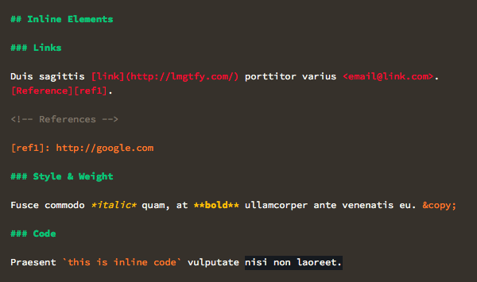

# Frontier Mou Theme

This is a Theme for the [Mou.app](http://mouapp.com/) markdown editor, based on [Frontier](https://github.com/daylerees/colour-schemes#frontier) by [daylereese](https://github.com/daylerees).

## Preview

## Installation

In Mou, go to *Preferences > Themes > Edit*. This will open your *Themes* folder. Copy `Themes/Frontier.txt` from this repository there. Hit *Preferences > Themes > Reload* and you should see it magically appear in the dropdown.
